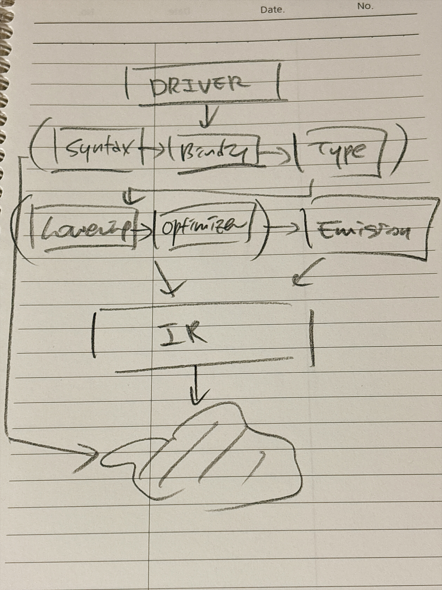

# GoAot

## Structure

## Backends

On AArch64 macOS, the CLI uses the native assembly backend by default.
On other platforms, it falls back to the C backend.

	lake exe goaot input.go -o program --backend aarch64-darwin
	lake exe goaot input.go -o program --backend c

The native backend currently supports signed 64-bit integers, zero or one function
argument, and Darwin arm64 assembly. Both backends use the system `cc` to link.

## MVP
